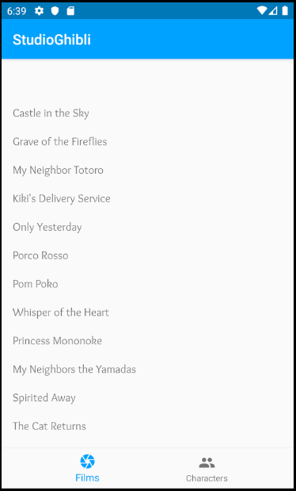
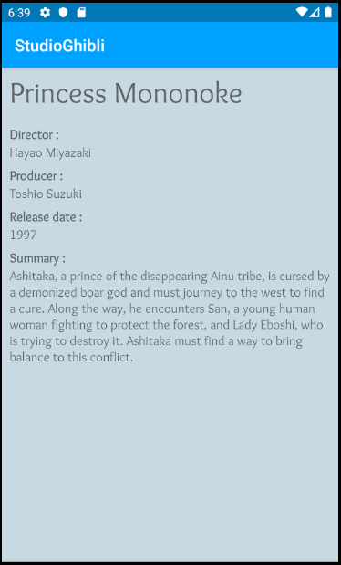
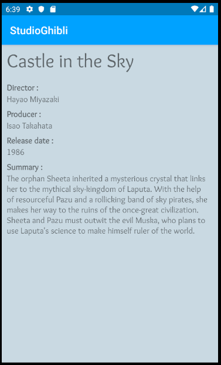
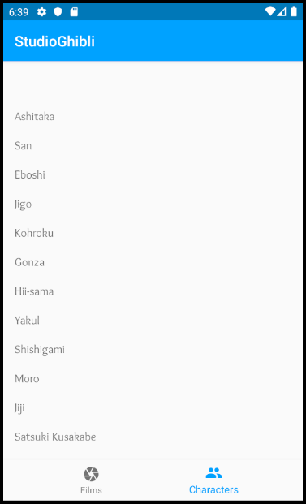
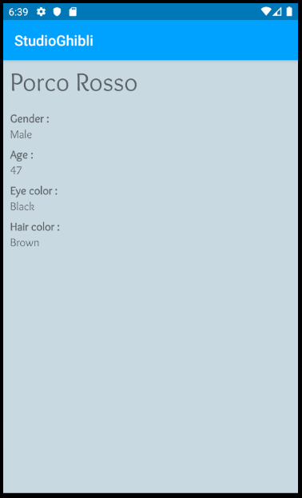
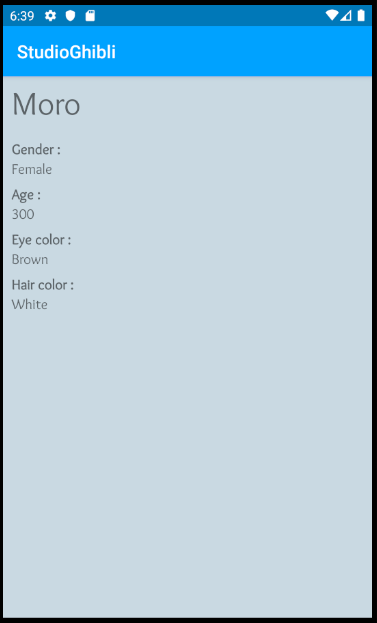

# StudioGhibli

## Présentation 

Application mobile en Java, utilisant l'architecture MVC.
L'application est basée sur l'API "ghibliapi". 
Elle affiche la liste de tous les films des Studios d'animation japonais Ghibli, leurs personnages et tout leurs détails.

## Outils de développement
- Environnement de développement : Android Studio

- Librairie pour effectuer des appels à des webservices REST sur Android Studio : Retrofit2

## Consignes et fonctionnalités

- 3 activités et 2 fragments
- Utilisation de *RecyclerView*
- Appel webservices à une API REST : <a href="https://ghibliapi.herokuapp.com/">ghibliapi</a>
- Architecture MVC
- GitFlow

### Liste des Films

Liste affichée à l'aide du *RecyclerView*. Le contenu de la liste est récupéré à l'aide d'un appel webservice REST.

### Détails d'un Film

Détails récupérés à l'aide d'un appel webservice REST. S'affiche lorsque l'on clique sur un Film.

### Liste des Personnages

Liste affichée à l'aide du *RecyclerView*. Le contenu de la liste est récupéré à l'aide d'un appel webservice REST.

### Détail d'un Personnage

Détails récupérés à l'aide d'un appel webservice REST. S'affiche lorsque l'on clique sur un Personnage.

